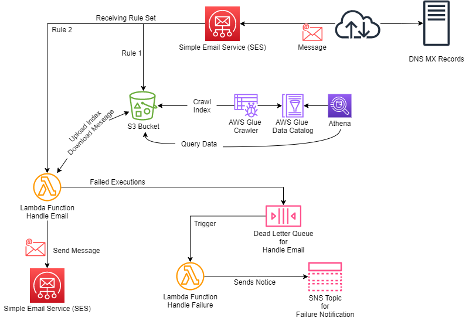

# SES Forwarder

This AWS SAM project uses AWS Simple Email Service (SES) to process email messages received 
and forward them to a different domain.

This project consists of:
* SES Receipt Rule Set to store email in S3 and trigger a Lambda Function.
* S3 Bucket to use for storage (may use an existing bucket).
* Lambda Function to retrieve email from S3 and forward to new recipient using SES Sending.
* SQS Queue to capture failed mail handling from Lambda Function.
* Lambda Function to generate a notice of failures.
* (Optionally) AWS Glue Crawler and Database for Athena to query the SES Notifications (index).



> _Diagram created and can be edited in [draw.io](https://app.diagrams.net/)_

If using an existing S3 Bucket, be sure the S3 Bucket Policy allows SES to write objects.
See [Sample S3 Bucket Policy for SES](ses-bucket-policy.json).

## Email Handling Flow

1. SES Receives an email message for a verified domain acording to the MX record from DNS for that domain.
2. SES will process the message acording to the active Email Receipt Rule Set.
3. Email Receipt Rule 1:  Store the message in the S3 Bucket with prefix `messages/`.
4. Email Receipt Rule 2:  Invoke Lambda function `HandleEmailFunction` (asynchronously).
    * If successful, the Lambda function will: 
      * save the SNS notification to the S3 Bucket with prefix `index/`.
      * transform the source and destination headers and send the message using SES.
    * If a failure occurs (throttled or returns an error), the SES notification is sent to the Dead Letter Queue (SQS).
      * If the failure happened during the `SES:SendRawEmail` API call, 
        the outgoing message is saved to the S3 Bucket with prefix `error/`.
5. Lambda function `HandleEmailDeadLetterFunction`


#### Note on Lambda Functions

Logs from a Lambda Function are automatically captured by CloudWatch Logs, using native features. 
A CloudWatch Logs group for each Lambda Function is created on the first execution.

**[Using AWS Lambda with Amazon SQS](https://docs.aws.amazon.com/lambda/latest/dg/with-sqs.html)**: 

> By default, Lambda polls up to 10 messages in the queue at once and sends that batch to the function. 
To avoid invoking the function with a small number of records, the event source can buffer records 
for up to five minutes by configuring a batch window. Before invoking the function, Lambda continues 
to poll messages from the SQS standard queue until batch window expires, the payload limit is 
reached or full batch size is reached.
> 
> When Lambda reads a batch, the messages stay in the queue but become hidden for the length of the 
queue's visibility timeout. If the function successfully processes the batch, Lambda deletes the 
messages from the queue. If the function is throttled, returns an error, or doesn't respond, the 
message becomes visible again. All messages in a failed batch return to the queue, so the 
function code must be able to process the same message multiple times without side effects.
> 

## Using Athena

Optionally, this template will setup an AWS Glue Crawler to run daily at midnight UTC.  The crawler 
will create or update tables in the AWS Glue Database.  Once run, the database will be ready for use 
by Athena.  Athena can query the data from S3 to provide analytics or help troubleshoot issues.

The data is partitioned by date (YYYY/MM/DD) and the data structure is defined in 
[Contents of notifications for Amazon SES email receiving](https://docs.aws.amazon.com/ses/latest/DeveloperGuide/receiving-email-notifications-contents.html).

Here are some sample queries that may be useful.
See [Amazon Athena User Guide - SQL Reference: SELECT](https://docs.aws.amazon.com/athena/latest/ug/select.html)
for details on what these queries do.

> Be sure to select the correct AWS Glue Database when running these queries.

**List Recent Message Details**

```
SELECT mail.timestamp, mail.source, mail.destination, mail.commonHeaders.subject, mail.messageId 
FROM "index" 
ORDER BY mail.timestamp DESC limit 10;
```

**List Top Source Addresses in the past month**

```
SELECT lower(mail.source) as source, count(DISTINCT mail.messageId) as message_count
FROM "index" 
WHERE from_iso8601_timestamp(mail.timestamp) >= (current_timestamp - interval '1' month)
GROUP BY lower(mail.source) LIMIT 10;
```

**List Top Source Domains in the past month**

Source email address might be of the form `Example User <User@Example.com>` so it needs to be normalized to get the domain.

```
SELECT lower(replace(split_part(mail.source, '@', 2), '>')) as source_domain, count(DISTINCT mail.messageId) as message_count
FROM "index" 
WHERE from_iso8601_timestamp(mail.timestamp) >= (current_timestamp - interval '1' month)
GROUP BY lower(replace(split_part(mail.source, '@', 2), '>')) LIMIT 10;
```

**List Top Destination Addresses in the past month**

Recall `mail.destination` is an array of destination email addresses.  It needs to be unnested.

```
SELECT destination, count(DISTINCT mail.messageId) as message_count
FROM "index" CROSS JOIN UNNEST(mail.destination) AS t (destination)
WHERE from_iso8601_timestamp(mail.timestamp) >= (current_timestamp - interval '1' month)
GROUP BY destination LIMIT 10;
```


## Deployment Guide

AWS SES must be setup to receive email for a domain.
The process of verifying a domain name and configuring DNS to send messages to AWS SES is beyond
the scope of this guide.  For information on how to do this, please review the 
[Amazon Simple Email Service Developer Guide:  Setting up Amazon SES email receiving](https://docs.aws.amazon.com/ses/latest/dg/receiving-email-setting-up.html).

Setting up Amazon SES email receiving (as described in the guide) can be completed before or
after deployment of this application. 
Email sent to any given domain will not be processed by this application until the domain setup 
has been completed and the SES Rule Set is activated.
Until both of these items happen, email may continue to be processed by other systems or rule sets 
depending on the DNS MX record for the domain and SES configuration (if applicable).

To deploy the application, use the [AWS SAM CLI](https://docs.aws.amazon.com/serverless-application-model/latest/developerguide/serverless-sam-cli-install.html). 
A quick start on the AWS SAM CLI is provided below. 
A "guided" deploy will prompt for all required and optional parameters.
For a description of each parameter, please review the details in the [template](template.yaml).

Following a successful deployment, the SES Rule Set created by the stack must be activated. 
Since AWS SES only allows a single SES Rule Set to be active per AWS Account, 
this step must be completed manually.

For a "blue/green" deployment, multiple stacks may be created in the same AWS Account. 
To upgrade from blue to green, simply "activate" the new SES Rule Set.


## Quick Start for SAM

##### Install the AWS SAM CLI:

[AWS SAM CLI Install Guide](https://docs.aws.amazon.com/serverless-application-model/latest/developerguide/serverless-sam-cli-install.html)

##### For the first deployment:

```bash
sam build --use-container                                # Build the source application
sam deploy --capabilities CAPABILITY_NAMED_IAM --guided  # Package and Deploy the application to AWS, save the config
```

##### After each change, to update the deployment:

```bash
sam build --use-container                       # Build the source application
sam deploy --capabilities CAPABILITY_NAMED_IAM  # Package and Deploy the application to AWS using a saved config
```

##### To invoke a function locally using event data:

```bash
sam build --use-container
sam local invoke HandleEmailFunction --event events/event.json
```

##### To invoke the function in Lambda:

```bash
aws lambda invoke --function-name <full_function_name> --invocation-type Event --payload fileb://<event>.json response.json
```

##### To view logs for any Lambda function:

```bash
sam logs -n HelloWorldFunction --stack-name <stack-name> --tail
```

##### To delete the application stack:

```bash
aws cloudformation delete-stack --stack-name <stack-name>
```

## Tests

Unit tests are included and use the `unittest` module.  Run tests using `python3 -m unittest`.

If you don't want `__pycache__` files, be sure to set `PYTHONDONTWRITEBYTECODE=1` before testing.

To validate the SAM CloudFormation template, use `sam validate` and also 
[cfn-lint](https://github.com/aws-cloudformation/cfn-lint): `cfn-lint template.yaml`.
